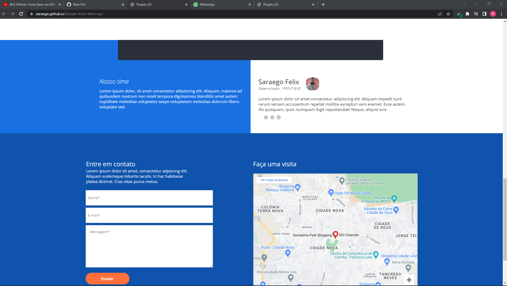

<h1> Estudo-front-html-css</h1>

<h2>Estudos para front-end</h2>

> Status: Home principal criado ⚠️

### este site foi criado para melhora e pratica o aprendizado em HTML5, CSS3 e resposividade e conceitos basicos

+ position: absolute, relative
+ criando background-img: aplicando a img de formas corretas
+ usando a semantica do html, como section, maim, nav e header.
+ usando classes e div para auxiliar melhor com a esturura de manipulação ao usar o css.
+ criando tambem formulario basico
+ cirando tambem um arquivo css separado para usar o resposivo, e nao deixa muito poluido a escrita do cod
+ E muita outras tecnicas .

### verifica >> <a href="https://saraego.github.io/Estudo-front-html-css/"> aqui</a>

